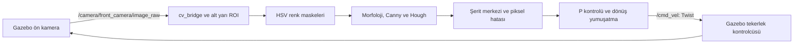

# ROS 2 ve OpenCV ile Şerit Takibi

Gazebo üzerindeki dört tekerlekli araç, ön kamera görüntüsündeki sarı ve beyaz
çizgileri kullanarak oval pistte otonom şerit takibi yapar.

Mevcut ortam Ubuntu 22.04 ve ROS 2 Humble kullanır. Kullanıcı, müdahalesiz tam turu
ve simülasyon ile kontrolcünün tek komutla başlamasını doğruladı. Otomatik testler
sentetik görüntülerle kontrol davranışını sınar; pistte sürüş testinin yerini almaz.

## Kurulum

Ubuntu 22.04 üzerinde ROS 2 Humble kurulu ve `rosdep` hazırlanmış olmalıdır.
Gazebo Classic ve OpenCV pencereleri için grafik masaüstü oturumu gerekir.
Depoyu bir çalışma klasörüne indirdikten sonra, aşağıdaki komutları `src`
klasörünün bulunduğu depo kökünde çalıştırın:

```bash
source /opt/ros/humble/setup.bash
sudo apt install python3-colcon-common-extensions python3-rosdep
rosdep install --from-paths src --ignore-src -r -y
colcon build --symlink-install
source install/setup.bash
```

`rosdep` henüz hazırlanmadıysa, bağımlılık kurulumundan önce bir kez
`sudo rosdep init`, ardından `rosdep update` çalıştırın.

## Otonom sürüş

Her yeni terminalde ortamı tanıtın; komutları depo kökünde çalıştırın:

```bash
source /opt/ros/humble/setup.bash
source install/setup.bash
ros2 launch my_robot_description lane_follow.launch.py
```

Bu komut Gazebo'yu, robot modelini, robot durum yayıncısını ve `camera_node`
düğümünü başlatır. Kamera görüntüsü geldiğinde OpenCV pencereleri açılır ve
çizgiler algılanırsa araç hareket eder. Terminalde `Ctrl+C` ile kapatılır;
kontrolcü normal kapanışta sıfır hız komutu gönderir.

## Elle sürüş

Otonom sürüşü kapatın ve yalnızca simülasyonu başlatın:

```bash
ros2 launch my_robot_description simulation.launch.py
```

Başka bir terminalde:

```bash
source /opt/ros/humble/setup.bash
source install/setup.bash
ros2 run teleop_twist_keyboard teleop_twist_keyboard
```

Klavye kontrolü isteğe bağlıdır; paket eksikse
`sudo apt install ros-humble-teleop-twist-keyboard` ile kurulabilir.
Klavye kontrolünü, kamera kontrolcüsünü veya sürekli `/cmd_vel` yayını yapan
başka bir komutu aynı anda çalıştırmayın; komutlar çakışır.

## Sistem nasıl çalışır?



`camera_node.py` içindeki temel bölümler:

- `detect_lane_lines`: Sarı/beyaz renk maskeleri ve Hough çizgi parçalarını bulur.
- `average_line` ve `smooth_line`: Çizgi parçalarını birleştirir ve titreşimi azaltır.
- `lane_center`: ROI yüksekliğinin %60'ındaki hedef satırda şerit merkezini bulur.
- `calculate_steering`: Piksel hatasını açısal hıza çevirir, sınırlar ve yumuşatır.
- `image_callback`: Görüntü işleme, merkez hesabı, komut yayını ve gösterimi birleştirir.

Hata, `şerit merkezi - görüntü merkezi` olarak hesaplanır. Pozitif hata için
negatif `angular.z` yayınlanır; araç sağa döner. Buradaki komut direksiyon açısı
değil, `Twist` mesajındaki açısal hızdır.

| Görüntü durumu | Davranış |
|---|---|
| Sarı ve beyaz çizgi var | Genişliği öğrenir, 0.30 m/s ile ilerler. |
| Yalnızca bir çizgi var | Genişlik tahminiyle merkez bulur, 0.12 m/s ile ilerler. |
| İki çizgi de yok veya çift çizginin genişliği geçersiz | Sıfır hız komutu gönderir. |

İlk görüntüde tek çizgi varsa başlangıç genişliği görüntü genişliğinin %80'idir.
Bu tahmin farklı kamera veya pistlerde ayar gerektirebilir. Görüntüde çizgilerin
kaybolması kontrol edilir; kamera mesajları tamamen kesilirse durduracak ayrı
bir zaman aşımı denetimi henüz yoktur.

Kontrol ayarları `CameraNode.__init__` içinde bulunur: `kp=0.005`,
`max_angular_speed=1.0` rad/s, `linear_speed=0.30` m/s ve
`steering_alpha=0.25`. Bunlar şu anda kod sabitleridir, ROS parametresi değildir.

## Dosya yapısı

```text
src/
├── my_robot_description/
│   ├── launch/simulation.launch.py   # Simülasyon ve aracı başlatır
│   ├── launch/lane_follow.launch.py  # Simülasyon + şerit takibi
│   ├── urdf/my_robot.urdf.xacro       # Araç, kamera ve sürüş eklentisi
│   ├── worlds/oval_track.world       # Oval pist
│   └── scripts/generate_oval_track.py
└── my_robot_controller/
    ├── my_robot_controller/camera_node.py
    ├── my_robot_controller/talker_node.py
    ├── my_robot_controller/listener_node.py
    └── test/test_lane_tracking.py
```

Talker ve listener, ROS 2 yayıncı/abone öğrenme örnekleridir; sürüşte kullanılmaz.
`NOTLAR.md`, geliştiricinin kişisel çalışma notlarıdır.

## Testler

Derlemeden sonra depo kökünde:

```bash
source /opt/ros/humble/setup.bash
source install/setup.bash
colcon test --packages-select my_robot_controller my_robot_description \
  --event-handlers console_direct+
colcon test-result --verbose
```

Davranış testleri iki çizgi, tek çizgi, çizgi yokluğu, öğrenilen genişlik,
geçersiz çizgi sıralaması, tek Hough parçası, dönüş yönü ve sınırı ile hareket
sonrası çizgi kaybında durmayı kapsar. Kontrolcü paketinde flake8 ve PEP257
kontrolleri de bulunur. Şablondaki telif hakkı testi mevcut haliyle atlanır;
lisans alanları henüz `TODO` durumundadır.

## Sorun giderme

- Paket bulunamıyorsa derlemeyi ve `source install/setup.bash` adımını kontrol edin.
- `Serit bulunamadi` yazıyorsa sarı/beyaz maske pencerelerinde algıyı kontrol edin.
- `Tahmini merkez` tek çizgiyle düşük hızlı takibin etkin olduğunu gösterir.
- Araç komutlara tutarsız tepki veriyorsa başka bir `/cmd_vel` yayıncısını kapatın.
- OpenCV pencereleri açılmıyorsa grafik masaüstü oturumundan çalıştırın.
